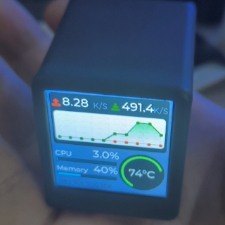
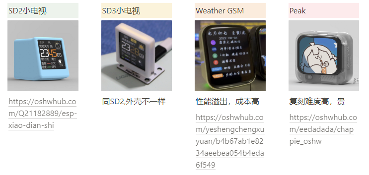
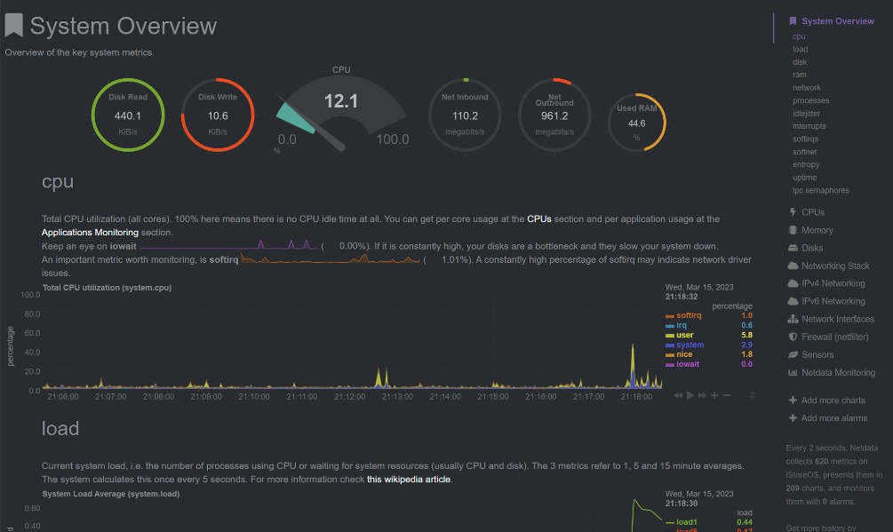
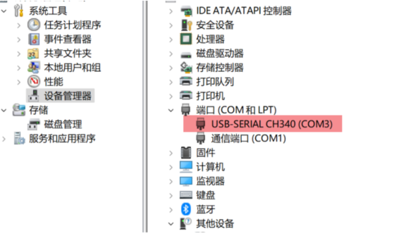
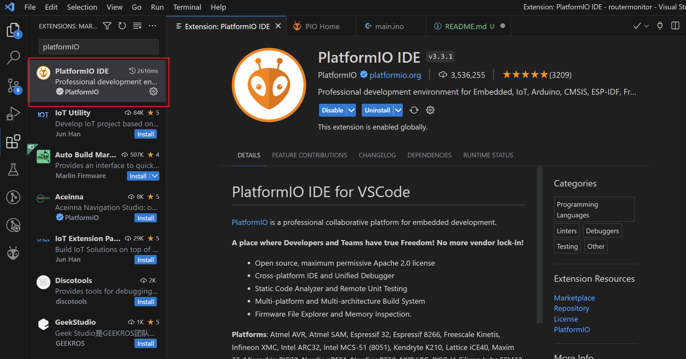
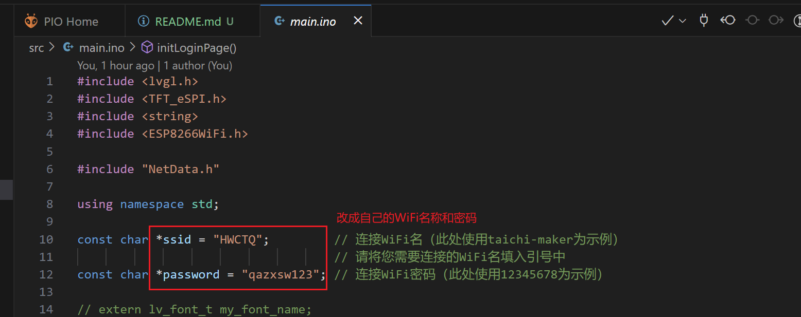
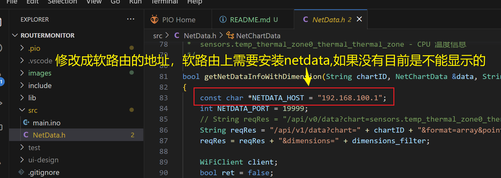
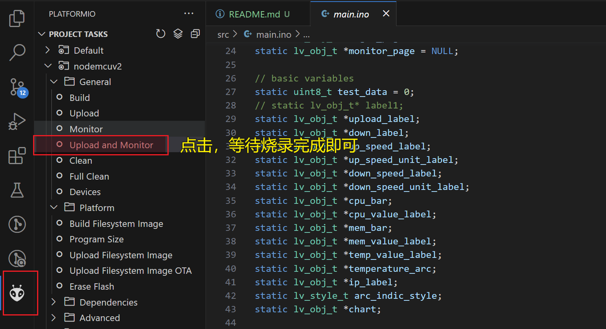

# 路由监视器 RouterMonitor
[toc]
## 前言
> 这个项目当前功能还比较简单，配置功能的完善比我预期的要麻烦，但是耐不住大家都很期待，因此就先开源再完善，有能力的小伙伴可以先玩起来，也欢迎贡献PR.

作者是一个对监测类软件情有独钟的人，比如windows上常用traffic monitor, mac就用腾讯的柠檬助手。 会把网速、cpu占用、温度等等信息挂在菜单栏，以此来作为一些程序是否正常运行的判断依据。

年初的时候意外接触到了ESP8266做的墨水屏日历，后来家里添置了软路由后，便鬼使神差的想着能不能做一个监视屏，然后就做了这个，起初的版本还没有图表，后来看到了Uinify路由器的小屏幕，便增加了图表的功能。

## 先上图
|RouterMonitor | RouterMonitor视频|  皮卡丘涂装   | 皮卡丘视频 |
|----|  ----  | --- |--- |
|  | <video src="images/routermonitor.mp4" height="320">|   | <video src="images/pikaqiu.mp4" height="320"> |

# 硬件资料

由于最初对这个功能的定位就是监视屏，也比较了市面上很多开源项目，出于成本考虑选择了SD2小电视的方案
https://oshwhub.com/Q21182889/esp-xiao-dian-shi

## 其他参考开源项目

- **Weather GSM** https://oshwhub.com/yeshengchengxuyuan/b4b67ab1e8234aeebea054b4eda6f549
- **Peak** https://oshwhub.com/eedadada/chappie_oshw

# 软件
## 数据信息来源 NetData
https://www.netdata.cloud/ 

NetData 提供了Web API 用于获取数据信息 https://learn.netdata.cloud/docs/rest-api/api
| 数据信息 | 接口 |
|-- | --- |
|CPU数据| /api/v1/data?chart=system.cpu&after=-10&format=array&points=10 |
|内存占用| /api/v1/data?chart=mem.available&format=array&points=1&group=average |
|网速监控-下行| /api/v1/data?chart=net.eth0&format=array&after=-10&points=10&dimensions=received|
|网速监控-上行| /api/v1/data?chart=net.eth0&format=array&after=-10&points=10&dimensions=sent |
|温度信息|  /api/v1/data?chart=system.cpu&after=-10&format=array&points=10 |

## UI界面绘制 LVGL
参考官方文档  https://docs.lvgl.io/7.11/
由于ESP8266使用的 lvgl版本比较低，无法使用官方的UI制作工作[SquareLine Studio](https://squareline.io/)
所以只能看文档写好了。

# 环境配置
Windows和mac都可以配置，M1的也可以，这里只提供windows的环境配置教程

## 0. 硬件购买
提供了三种方案和成本供大家评估选择
-  **简单模式**：小电视硬件成品的话可以去淘宝咸鱼PDD搜SD2小电视，一般价格在50左右，听说有个店39元包邮
  > 选择购买成品的小伙伴请务必跟卖家确认小电视是不是带CH340芯片，支持自己烧录固件，因为这个芯片单价就2块钱，有些卖家会选去掉这个芯片节约成本  
-  **中等难度**：淘宝买个ESP8266的开发板，加一个 1.3寸的TFT屏幕,带数据线，大概30块钱，没有外壳
-  **困难等级**： 如果想自己练习焊接，可以去嘉立创打板，购买零件、3D外壳打印，一站式(成本也最高，算上焊接工具，成本得300左右)

## 1. CH340驱动安装
### 1.1 驱动下载安装
https://www.wch.cn/downloads/category/67.html?feature=USB%E8%BD%AC%E4%B8%B2%E5%8F%A3&product_name=CH340

根据自己的平台下载对应的版本然后安装。

### 1.2 检验安装是否成功
使用usb的数据线连接小电视或者开发板，如果 `资源管理器`面板可以看到新增了串口，说明安装成功

## 2. 开发环境搭建
1. 安装Visual Studio Code
2. 安装插件 PlatformIO

3. Clone 代码，然后打开即可

## 3. 修改代码配置
代码很简单，只有两个文件，应该很容易看得懂

- main.ino 主要逻辑
- NetData.h 基于封装的获取netdata的接口

> 扛不住大家的热情（嗯，不是因为我懒）配置功能还没有完善，我就决定先开源了，所以有能力的小伙伴可以先改代码定制自己的RouterMonitor

1. 修改默认的连接Wifi的账号和密码

2. 修改软路由的地址

## 编译并烧录
1. USB连接上小电视或者开发板
2. VSCode点击左侧platformIO的图表，点击`Upload and Monitor` 等待编译烧录完成即可

